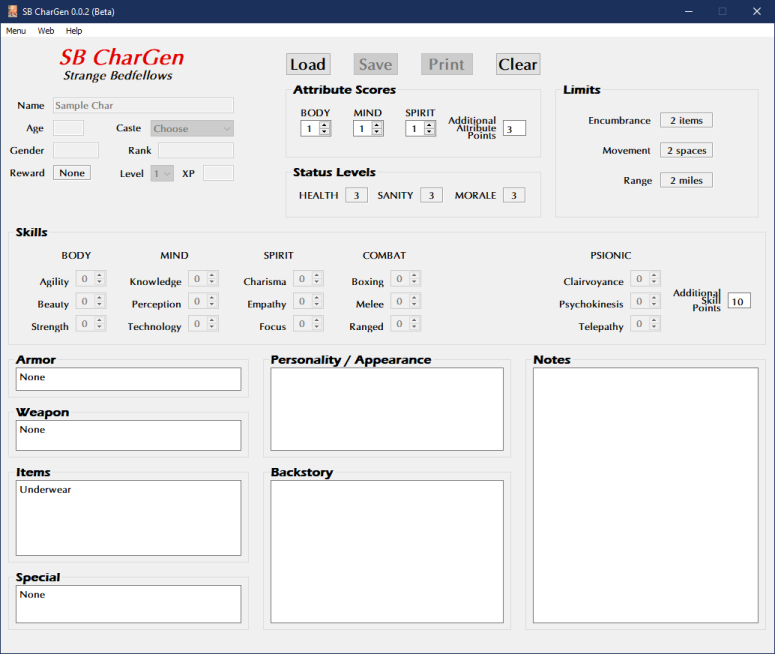

**Strange Bedfellows RPG Character Generator**
==============================================

**Strange Bedfellows RPG Character Generator** is a Windows program for creating characters using the Total Party Skills system.

Notes
-----

**Strange Bedfellows RPG Character Generator** is being developed using Python 3.9.10 and PyQt5.

Requirements
------------

* **Windows 10**

   It might not work in OSX or Linux.

* **Python 3.9.10**
   
   This code was written using the C implementation of Python
   version 3.9.10. Also known as CPython.
   
* **PyQt5 5.15.4**

   PyQt5 is the framework used for displaying the Window GUI and buttons, etc.

* **fpdf2 2.4.5**

   Fpdf2 is needed for printing the character sheets.
   

Warning
-------

This code will not work with **Python 2.7-**.

Not Using Python?
-----------------

You can always run the .EXE version for Windows 10 if you don't have the Python language installed. The .EXE version does not create PDFs
at this time.

.. |ss| raw:: html

    <strike>

.. |se| raw:: html

    </strike>

Things To-Do
------------

| Fix psionic-checking when leveling up character.
| Continue unifying the skills across all TPS genres.
| Instruction manual.
| Cheat codes.
| Add/borrow psionics check for future use from We Want Soviet Men!
|ss|

| Move PDF character sheets closer to program folder.
| Add Encumbrance rules from Rocket Cadets in the 11th Dimension!
| Start on a To-Do.

|se|

**Known History**

* v0.1.1b

  Updated to Python 3.9.10.
  
  Generates only female characters now. No men.

* v0.1.0b

  Moved the saving of PDF character sheets to the program folder.
  
  Added ON/OFF toggle for Encumbrance.
  
  Added psionics check for future knowledge.

* v0.0.2b

  Initial release.

Part of the Escape from Planet Matriarchy! RPG, written by R. Joshua Holland.
Copyright 2021 - 2022, Total Party Skills.
https://www.drivethrurpg.com/product/371424/Escape-from-Planet-Matriarchy

Contact
-------
Questions? Please contact shawndriscoll@hotmail.com
