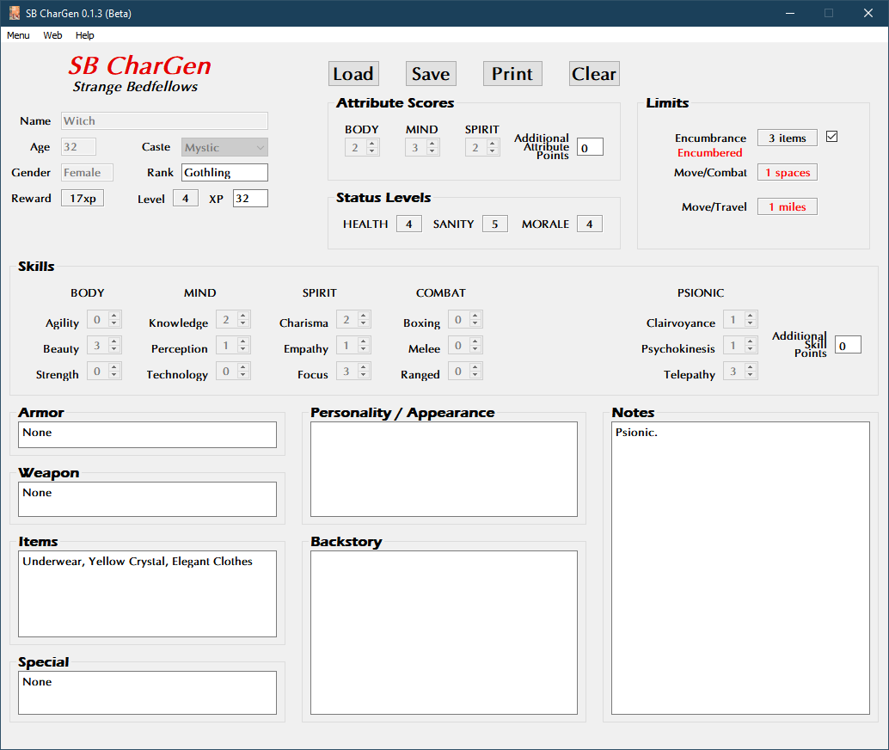

**Strange Bedfellows RPG Character Generator**
==============================================

.. figure:: images/sb.png

**Strange Bedfellows RPG Character Generator** is a Windows program for creating characters using the Total Party Skills system. It is based off of Episode Four of Escape from Planet Matriarchy!

Notes
-----

**Strange Bedfellows RPG Character Generator** is being developed using Python 3.11.6 and PyQt5.

Requirements
------------

* **Windows 11**

  It will also run in Windows 10.

* **Python 3.11.6**
   
  This code was written using the C implementation of Python
  version 3.11.6. Also known as CPython.
   
* **PyQt5 5.15.9**

  PyQt5 is the framework used for displaying the Window GUI and buttons, etc.

* **fpdf2 2.7.5**

  Fpdf2 is needed for printing the character sheets.
   

Things To-Do
------------

| Continue unifying the skills across all TPS genres.
| Instruction manual.
| Cheat codes.

Known History
-------------

* v0.3.0b

  Compatible with TPS Die Roller 0.5.0.

* v0.2.1b

  Fixed skill and score caps when saving.

* v0.2.0b

  Character PDFs are now saved in **Characters** folder.

* v0.1.5b

  Updated to fpdf2 2.7.5.

* v0.1.4b

  PDF charsheets can now be created in EXE version.

* v0.1.3b

  Updated to Python 3.11.0.

* v0.1.2b

  Added checks when generating characters with psionic skills.
  
  The TPS DieRoller now recognizes psionic characters from this generator.

* v0.1.1b

  Updated to Python 3.9.10.
  
  Generates only female characters now. No men.

* v0.1.0b

  Moved the saving of PDF character sheets to the program folder.
  
  Added ON/OFF toggle for Encumbrance.
  
  Added psionics check for future knowledge.

* v0.0.2b

  Initial release.

Part of the Escape from Planet Matriarchy! RPG, written by R. Joshua Holland.
Copyright 2021 - 2022, Total Party Skills.
https://www.drivethrurpg.com/product/371424/Escape-from-Planet-Matriarchy

Contact
-------
Questions? Please contact shawndriscoll@hotmail.com
